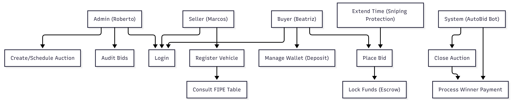

# Use Case Diagram

This document illustrates the interactions between the actors (users and system) and the main functionalities of the **AutoBid** platform.

## 📊 Visual Representation

  
   
  <em>Figure 1: AutoBid Use Case Diagram generated via Mermaid.</em>

---

## 🔄 Revision History

| Date | Name | Observation |
| :--- | :--- | :--- |
| 2026-02-17 | Gemini Pro & Taynara Vitorino | Initial document creation via AI and technical review of requirements. |
| | | |