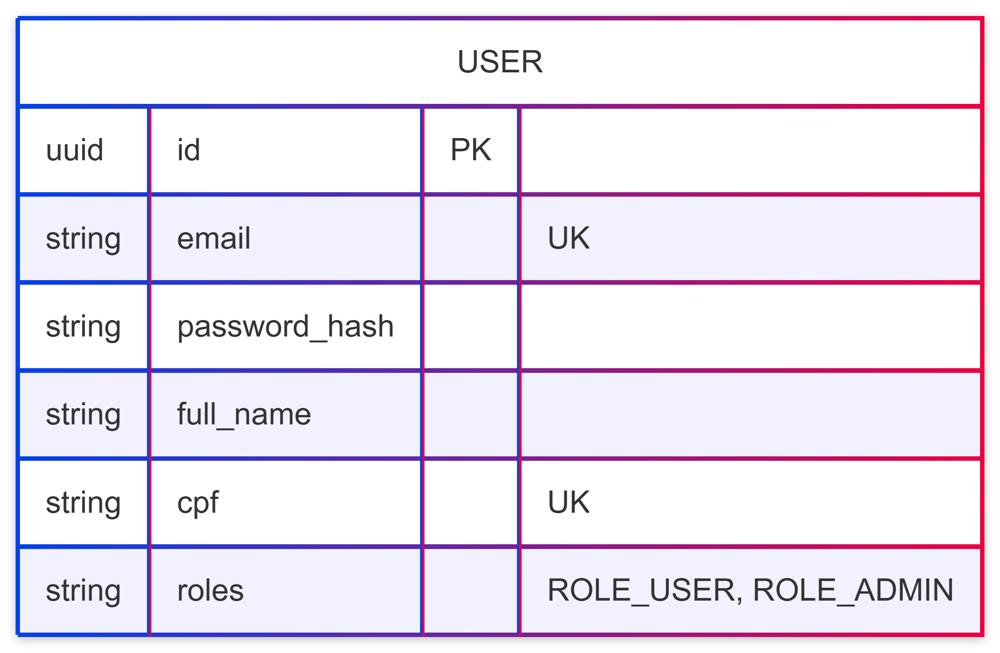
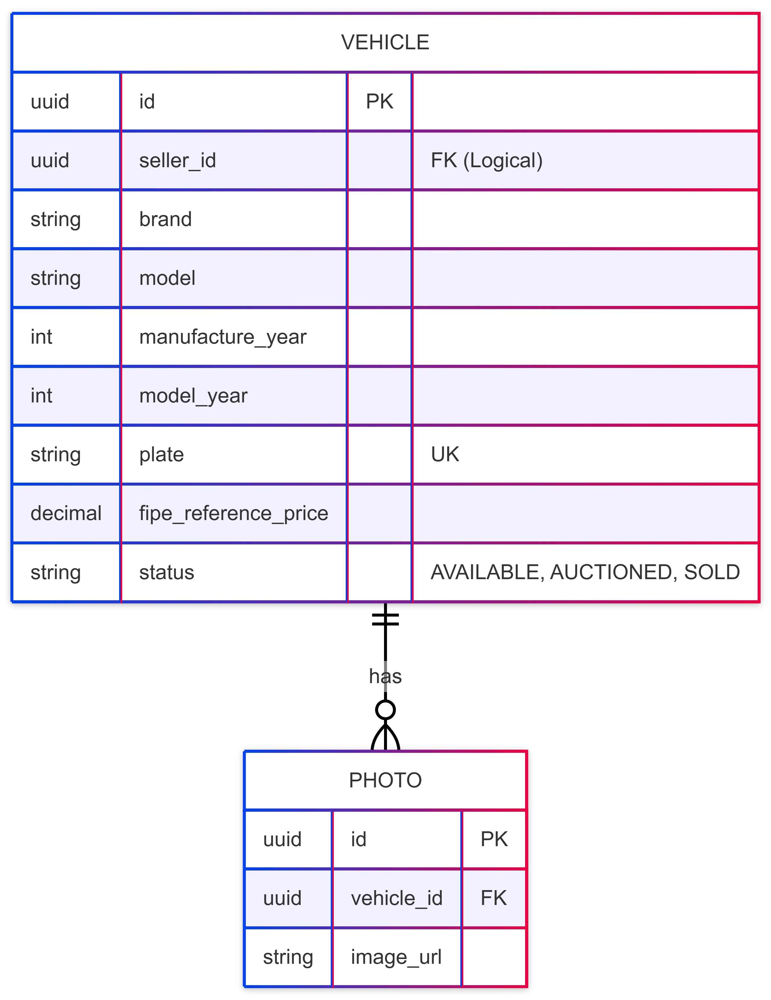
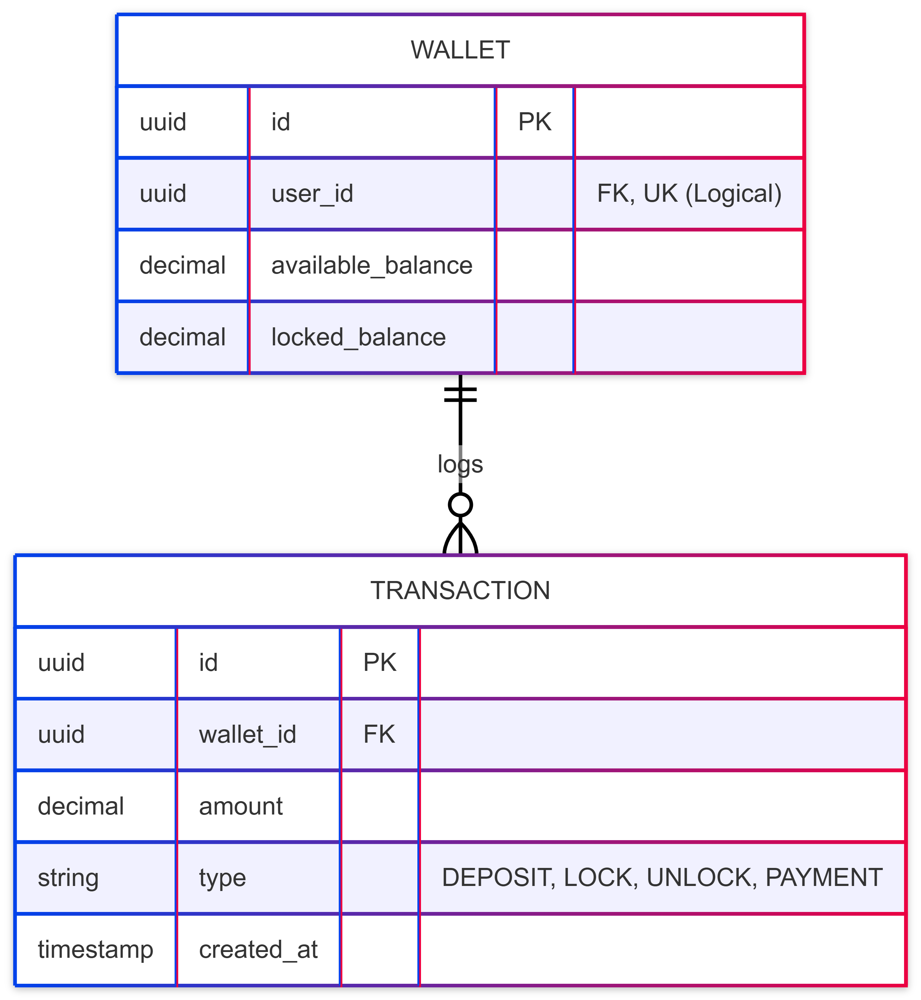
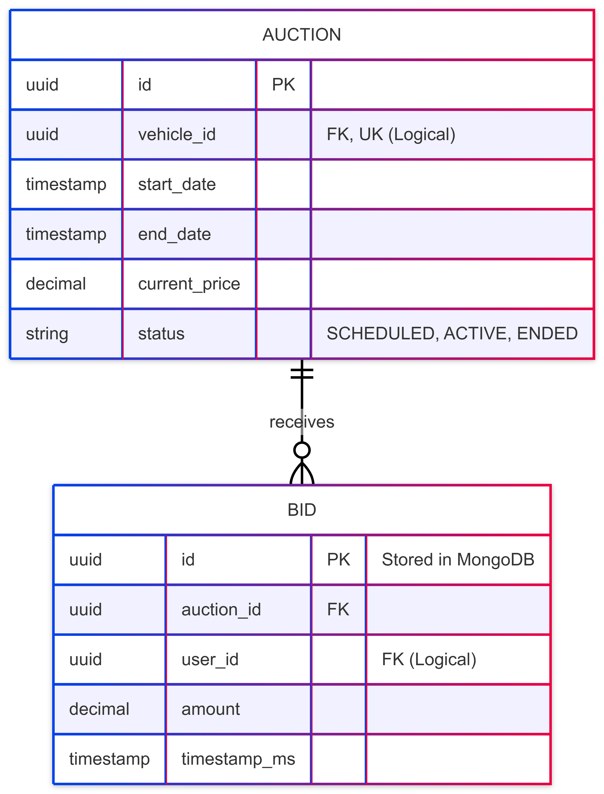

# Data Model (ER Diagrams)

This document describes the data architecture for the **AutoBid** ecosystem. Following the **Database-per-Service** pattern, each microservice owns its own data store to ensure independence, scalability, and technical flexibility.

## 🏗️ The Microservices Data Strategy

In a microservices architecture, splitting data across multiple data stores is a fundamental trade-off. While traditional monolithic databases rely on physical **Foreign Keys (FK)** to ensure clean data and referential integrity, microservices require a different approach to maintain resilience and isolation.

### The Logical Foreign Key Approach
For **AutoBid**, we do not use physical Foreign Key constraints between different services' databases. Instead:
* **Decoupling:** Services are blind to each other's database schemas.
* **Logical References:** Entities are linked via **UUIDs**. For example, an Auction record stores a `vehicle_id`, but the database does not check if that ID exists in the Vehicle service.
* **Validation in Code:** Data integrity is enforced at the application level (Java) or through eventual consistency via events.

---

## 📊 Database Schemas

### 1. Identity Service (`ms-identity`)
This service manages user credentials and access roles. It uses **PostgreSQL** for its robust handling of structured data and ACID compliance.

  
   
  <em>Figure 2: Identity Service Entity Relationship Diagram.</em>

### 2. Vehicle Service (`ms-vehicle`)
Responsible for the vehicle catalog and technical details. It integrates with external APIs to validate market values.

  
   
  <em>Figure 3: Vehicle Service Entity Relationship Diagram.</em>

### 3. Financial Service (`ms-financial`)
The system's "Bank." It manages wallets and keeps an immutable ledger of all transactions. **PostgreSQL** is mandatory here to ensure financial transactions are never lost or corrupted.

  
   
  <em>Figure 4: Financial Service Entity Relationship Diagram.</em>

### 4. Auction Service (`ms-auction`)
The high-performance core. It manages live auctions and bid history. It uses **MongoDB** to handle high write-throughput of bid logs.

  
   
  <em>Figure 5: Auction Service Entity Relationship Diagram.</em>

---

## 🛠️ Data Modeling Decisions Summary

* **UUID over Long:** All primary keys use UUIDs to prevent ID collisions and avoid exposing the total number of records in the system via sequential IDs.
* **Polyglot Persistence:** We use the best tool for each job—Relational (PostgreSQL) for money and users, and NoSQL (MongoDB) for high-frequency bid streams.
* **Auditability:** Tables like `TRANSACTION` and `BID` are **append-only**. We never modify a previous bid or transaction; we only add new records to ensure a perfect audit trail.

---

## 🔄 Revision History

| Date | Author | Description |
| :--- | :--- | :--- |
| 2026-02-17 | Gemini Pro & Taynara Vitorino | Initial creation of Data Model documentation and explanation of the Foreign Key Dilemma. |
| | | |