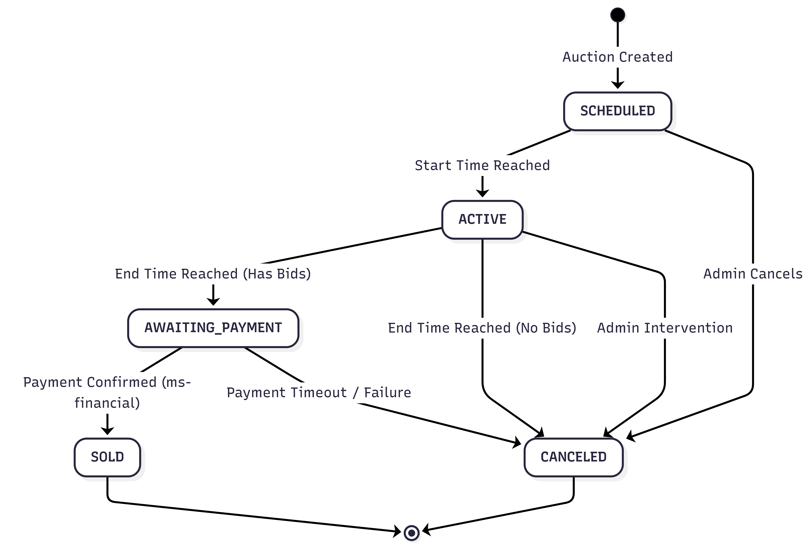

# Auction State Machine Diagram

This document describes the lifecycle of an auction within the **AutoBid** ecosystem. It defines the possible states an auction can reside in and the events that trigger transitions between them.

## 📊 Visual Representation

<em>Figure 7: AutoBid Auction State Machine generated via Mermaid.</em>

## 📝 State Descriptions

### 1. SCHEDULED
**Description**: The auction has been created by an Administrator but the start date/time has not yet been reached.

**Business Rule**: Users can see the vehicle but cannot place any bids yet.

### 2. ACTIVE
**Description**: The bidding window is open.

**Business Rule**: The system accepts bids that meet the minimum increment requirements and have verified funds.

**Sniping Protection**: The end time may be dynamically extended if bids occur in the final minutes.

### 3. AWAITING PAYMENT
**Description**: The auction clock has expired and a winning bid was identified.

**Business Rule**: The winning amount remains in a "Locked" state in the buyer's wallet while the system waits for final settlement confirmation from the financial module.

### 4. SOLD
**Description**: The final successful state.

**Business Rule**: Payment is successfully processed, the vehicle status is updated to "Sold," and the auction is closed permanently.

### 5. CANCELED
**Description**: The terminal failure state.

**Causes**: No bids were placed before the timer expired.

- The winning user failed to complete the payment within the grace period.

- An Administrator manually canceled the auction for auditing reasons.

---

## 🔄 Revision History

| Date | Author | Description |
| :--- | :--- | :--- |
| 2026-02-17 | Gemini Pro & Taynara Vitorino | Initial creation of Data Model documentation and explanation of the Foreign Key Dilemma. |
| | | |